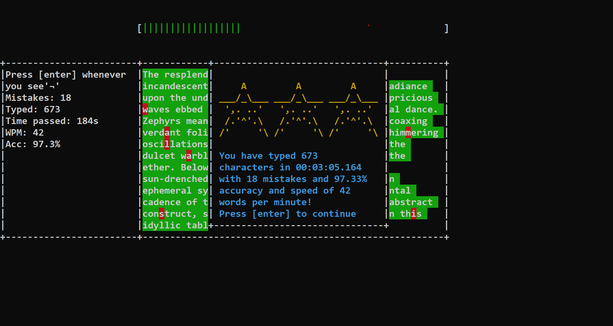

# Introduction

## What is Null Type
Null Type is a typing lesson application that runs on console without any UI/GUI. 
It uses <strong>Vibend</strong> (A DLL made by <strong>Code Crafter Log</strong>) instead of ncurses.

## Game Modes
### Example Text
Write example texts with difficulties from `Piece of cake`, `Tricky` up to `BEAST`. 
Where each of them have its own length and words.

### AI Text
Write an AI generated text based on your topic with again three difficulties of
`Piece of cake`, `Tricky` up to `BEAST`.  
Each difficulty has its own word level, and text length. 
Made possible by `meta-llama` free edition:
`meta-llama/llama-4-maverick:free`

### Words
Practice typing with perfect accuracy.
Type some example words based on difficulty that you choose.
Get <strong>Accuracy Streaks</strong>
 and try to hit your high-score.

# Build & Run
## Manual Build
This project is designed by & for `Visual Studio` the codes are designed for `x86` operators so you can build them for any architecture. 
* This is what we recommend
## Use Releases
If you only want to try the project and you do not want to go deep into building it, use the release for Windows x86.